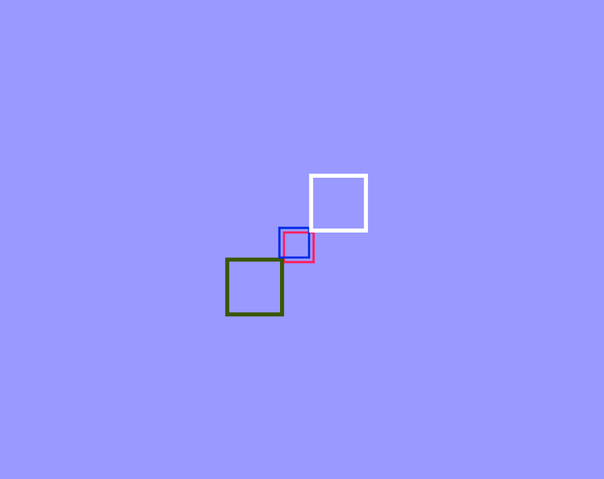

<!--Markdown tutorial-->
<!--Here we will know markdodwn systex-->
My name is Mohammed Faysal  
This is second line
Text align center

---

# Mohammed Faysal
## Web Developer
### Creative JS Coder
#### Creative JS Coder
##### Creative JS Coder
###### Creative JS Coder

<p>My name is Mohammed Faysal. I'm 23 years old. I just completed B.sc at International Islamic University Chittagong.</p>

<i>This is an Italic Tag</i>  
_This is an Italic Tag_


<b>This is a Bold Tag </b>  
__This is a Bold Tag__


<u> This is underline Tag </u>


<del> This is strikethrough Tag </del>  
~~This is strikethrough Tag~~

`This is inline code. for single line`  
`<p>This is inline code. for single line</p>`

```css

This is for multiline_code.  
*{
    margin: 0;
    padding: 0;
    font-family: 'Poppins' sans-sarif;
    box-sizing: border-box;
}

```

```html

<h1> Hello everyone </h1>
<p> My name is Mohammed Faysal </p>
<p> I'm 23 years old </p>

```

```javascript

console.log('Are you want to delete')

```

## Ordered List in HTML
<ol> 
    <li>one</li>
    <li>Two</li>
    <li>Three</li>
</ol>

## ordered List
1. Item1
2. Item2
    1. Item1.1
    2. Item1.2
    3. Item1.3
3. Item3 


## Unordered List.
- Item1
    - Item1.1
    - Item1.2
- Item2
    1. Item2.1
    2. Item2.2
- Item3
- Item4 


## Task List.
- [x] Task1
- [x] Task2
- [x] Task3
- [x] Task4


## Automatic Link.
https://www.youtube.com


## Disable link
`http://www.youtube.com`


### Markdown link syntax. link ke text e convert kora.
[CreativeJsCoder][youtubelink]  
[Facebook][facebook]


## All links is here.🤗
[Websitelink]: https://www.website.com
[youtubelink]: https://www.youtube.com
[developerlink]: https://www.developer.com
[facebook]: https://www.facebook.com


## Add image😃



## Add Emoji (for Emoji search emojipedia.org) 💖

<br>

## Add Table:
| Name | Age | City | Email | Mobile |
| ----- | ---- | --- | ---- | ---- |
| Faysal | 23 | Chittagong | fay@gmail.com | 22345 |
| Shakib | 24 | Dhaka | sha@gmail.com | 23445 |
| Showkot | 23 | Rajshahi | saw@gmail.com | 3334 |


